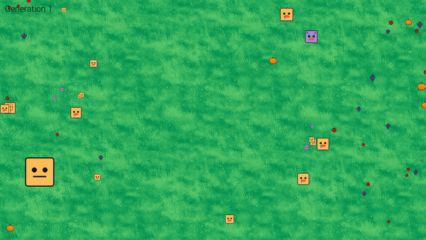
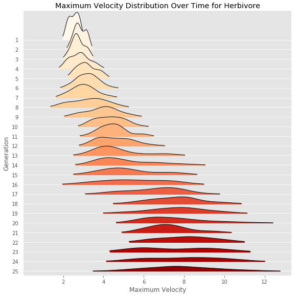

# Evolution Simulation
The simulation consists of an endless number of rounds. In each round, *n* herbivores are spawned in the center of the screen, and *m* carnivores are spawned a configurable distance away from the center. Vegetables will be spawned outside of the center. Carnivores will try to eat the herbivores and herbivores will try to eat vegetables. If a carnivore has reached maximum size they will go to sleep and no longer hunt. The generation ends once all vegetables are eaten. If a creature eats enough food, they will produce offspring for the next round and pass on their traits. The traits of their offspring will be randomly mutated based on the parent's values. 

To run the simulation:
1. Run `pip install -r requirements.txt` or install the requirements into a virtual environment.
2. Run `python evolution_sim.py`

The simulation ends on user input, or when there is a round with no herbivore offspring. 

  
 

## Creature Traits

  

*The different states of the herbivores in the simulation. Hungry, Neutral, Satisfied.*
 

The following traits can be passed down to the next generation.

`max_size` - The maximum size of the creature. This determines a creature's hunger, the amount of food needed for the creature to produce offspring for the next generation. 

`width, height` - The size of the creature in pixels. Maximum velocity is decreased as the creature grows. Bigger creatures are more difficult to eat. 

`defense` - This is part of the formula that determines if a creature can be eaten by a carnivore. Higher defense means that the creature is harder to eat. Since the game can be configured so that carnivores can eat each other, carnivores will have this trait as well.

`jerk` - The rate of change of acceleration.

`acceleration_max` - The maximum acceleration in x, y direction. 

`velocity_max` - The maximum velocity in x, y direction. 

`num_offspring_divisor` - If the creature survives the round, they will produce  children for the next round.  If a creature survives a round they will produce at least one child. 

`search_distance` - The distance that a creature can sense food at. If there is no food within the search distance, the creature will move randomly. Carnivores will only be attracted to creatures that they can consume.

`fear` - The distance that a herbivore can sense carnivores at. Herbivores will move away from carnivores that they can sense. 

### Carnivore Specific Traits

`attack` - This is part of the formula that determines if a carnivore can eat a creature. Higher attack means that it is easier to eat other creatures.

  

*The different states of the carnivores in the simulation. Hungry, Hibernating.*
 

## Configuration 
`config.py` has many variables that determine the initial state of the simulation. 

`num_tomato`, `num_pumpkin`, `num_grape` - The amount of food generated in each generation. 

`num_basic_searching_herbivores` - The number of creatures generated in the starting generation. 

`base_...` - The base values of the Traits defined above for the first generation. Note that these values will be randomly mutated even for the first generation of creatures.

`predators_can_eat_each_other` - If this is set to true then predators can eat each other if they collide.

## User Input
Press `Escape` or the `X` button to exit the simulation. Press the `Left` and `Right` arrow keys to change the game speed. 

## Logs
After the simulation ends, a csv file of all the creatures in the simulation will be written into the `logs` folder. 

## Analysis
Analysis of some interesting simulations can be found in the `analysis` folder. The first analysis [here](https://github.com/justinctse/EvolutionSim/blob/master/analysis/example_1.ipynb) serves as a tutorial.

  

*The distribution of velocity for Herbivores over time for a single run. Check the link above to see more insights like this.*
 
