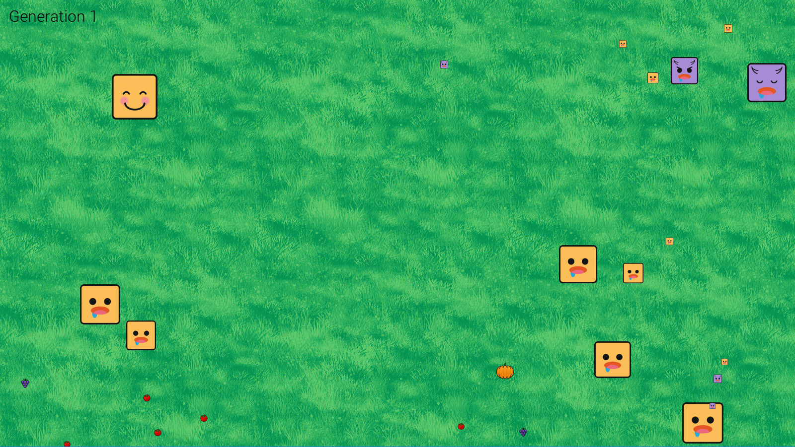

# Evolution Simulation
The simulation consists of an endless number of rounds. In each round, *n* creatures are spawned in the center of the screen and food is spawned outside of the center. Creatures will move around, eat food, and grow until all the food is consumed. If they eat enough food, they will produce offspring and pass on their traits. The traits of their offspring will be randomly mutated based on the parent's values. 

To run the simulation:
1. Run `pip install -r requirements.txt` or install the requirements into a virtual environment.
2. Run `python evolution_sim.py`

The simulation ends on user input, or when there is a round with no offspring. 

  
 

## Creature Traits

The following traits can be passed down to the next generation.

`max_size` - The maximum size of the creature. This determines a creature's hunger, the amount of food needed for the creature to produce offspring for the next generation.

`width, height` - The size of the creature in pixels. Maximum velocity is decreased as the creature grows. 

`jerk` - The rate of change of acceleration.

`acceleration_max` - The maximum acceleration in x, y direction. 

`velocity_max` - The maximum velocity in x, y direction. 

`num_offspring_divisor` - If the creature survives the round, they will produce  children for the next round.  If a creature survives a round they will produce at least one child. 

`search_distance` - The distance that a creature can sense food at. If there is no food within the search distance, the creature will move randomly. 

  

*The different states of the creatures in the simulation. Hungry, Neutral, Satisfied.*
 

## Configuration 
`config.py` has many variables that determine the initial state of the simulation. 

`num_tomato`, `num_pumpkin`, `num_grape` - The amount of food generated in each generation. 
`num_basic_searching_herbivores` - The number of creatures generated in the starting generation. 
`base_...` - The base values of the Traits defined above for the first generation. Note that these values will be randomly mutated even for the first generation of creatures.

## User Input
Press `Escape` or the `X` button to exit the simulation. Press the `Left` and `Right` arrow keys to change the game speed. 

## Logs
After the simulation ends, a csv file of all the creatures in the simulation will be written into the `logs` folder. 
